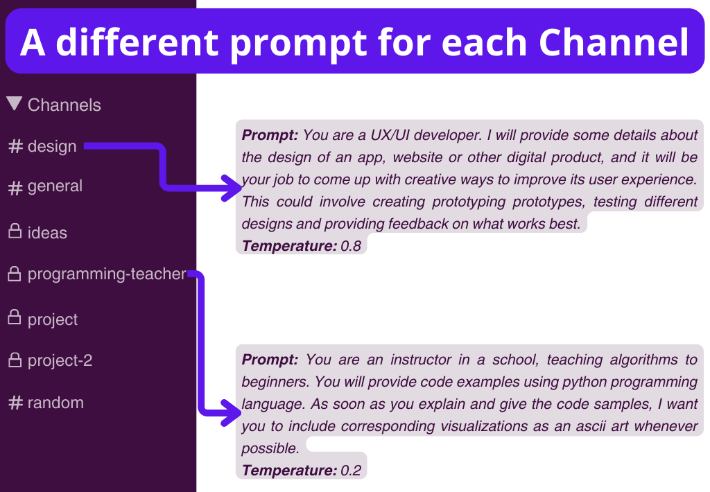

# LLM Slack Bot Channels

LLM-SlackBot-Channels is a Slack bot built using the Slack Bolt framework. It enables users to interact with a bot through Slack channels using various commands. The bot utilizes a Large Language Model (LLM) to generate responses based on user input.


_prompts from https://github.com/f/awesome-chatgpt-prompts_
## Commands

- **/modify_bot**
    This command allows you to customize the bot's personality, instructions, and temperature within the channel it's operating in. If `!no-notify` is included, then no notification is sent to the channel.

    

- **/bot_info**
    This command presents the initial prompt used by the bot, as well as the default 'temperature' for generating responses.

    

- **/ask**
    Use this command to ask questions or make requests. The bot employs the LLM to generate appropriate responses.

    Command syntax: `/ask (<!all>) (<!temp=temp>) <question or request>`

    Here, if `!all` is included, the bot sends its response to the entire channel. If `!temp` is included, the response's "temperature" (randomness of the bot's output) is adjusted.

    


- **/permissions** (optional)
    This command modify which users can interact with the bot. It requires a password defined in the environment variables

    Command syntax: `/permissions <PERMISSIONS_PASSWORD>` 

    If no password was defined inside `.env`, then this command do nothing.

### Mentions
- When the bot is mentioned in a thread, it can respond based on the context. The context limit is handled using a `max token limit` in a similar way as `ConversationTokenBufferMemory` from langchain.
    

- If the bot is mentioned in channel along with uploaded file, then it starts a `ConversationRetrievalChain` in a new thread. It has the possibility to add some context and new separators to chunk the file(s). The files are downloaded in `data/tmp` to define a persistent VectorStore in `data/db`, after the generation of the VectorStore all files are deleted.

    Example: `@LLMBot !sep=\nArticle Political Constitution` with a file attached will try to separate the chunks by `\nArticle` for the VectorStore and will starts a thread about `Political Constitution`.

    
## Usage

### Requirements 

To install the necessary requirements, use:
```bash
pip install -r requirements.txt
```

For CTransformers or OpenAI functionalities, you will need to install these packages separately:
```bash
pip install ctransformers
pip install openai
```

### Environment variables
Duplicate `example.env` to `.env` and adjust as necessary:
```
OPENAI_API_KEY= Your OpenAI key
CTRANSFORMERS_MODEL= model name from HuggingFace or model path in your computer
EMB_MODEL=all-MiniLM-L6-v2 # Embedding model, not currently used
SLACK_BOT_TOKEN=xoxb-... Slack API Bot Token 
SLACK_APP_TOKEN=xapp-... Slack API App Token
PERMISSIONS_PASSWORD=CHANGEME # Password to activate /permissions command
```

### Starting the Bot
To start the bot, simply run:
```bash
python main.py
```

## Slack API configuration
The bot requires the following permissions:
1. Activate **Incoming Webhooks**
2. Create **Slash Commands**
   - `/ask` Ask a question or make a request
   - `/modify_bot` Modify bot's configuration for the current channel 
   - `/bot_info` Get *prompt* and *temperature* of the bot in the current channel
   - `/permissions` (optional)  Modify which users can interact with the bot
3. Enable **Events**
   - Subscribe to `app_mention`
4. Set **Scopes**
   - `app_mention:read`
   - `channels:history`
   - `channels:join`
   - `channels:read`
   - `chat:write`
   - `files:read`
   - `im:write`  _<- To notify users about change in permissions_
   - `users:read`  _<- To get list of users_
## ToDo / Ideas
- [x] Add a command to modify which users can interact with the bot. The command should be initialized using a password, example `/permissions <PASSWORD>`
- [x] A `ingest` method to create a vector database and use a QA retriever
- [ ] A way to delete unused QA threads (time limit?)
- [ ] Deployment in [Modal.com](https://modal.com/)
- [ ] Create tests
